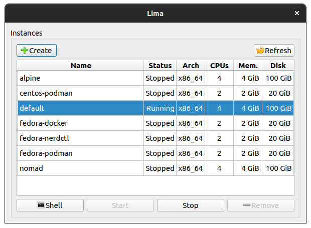
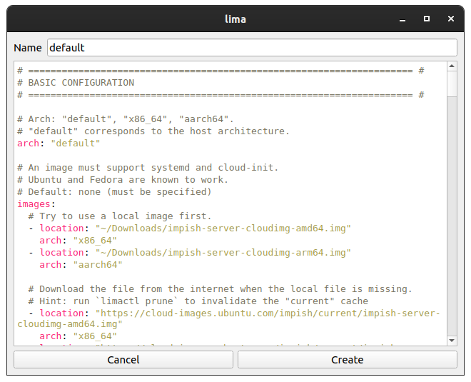
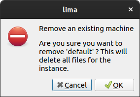

# System Tray Icon

## Running

Open in [Qt Creator](https://doc.qt.io/qtcreator/) GUI:

```shell
qtcreator systray.pro
```

Or on the command line:

```console
$ qmake
$ make
...
$ ./lima-gui
```

## Screenshots

### Main window



#### Create



#### Remove



----

See <https://doc.qt.io/qt-5/qtwidgets-desktop-systray-example.html>

Tux icon from the Crystal project by Everaldo Coelho.
The icons are licensed under the GNU Lesser General Public License (LGPL).

Unix builds (Linux, Mac) will need to install qtermwidget dependency:

See <https://github.com/lxqt/qtermwidget> (not available on Windows)
